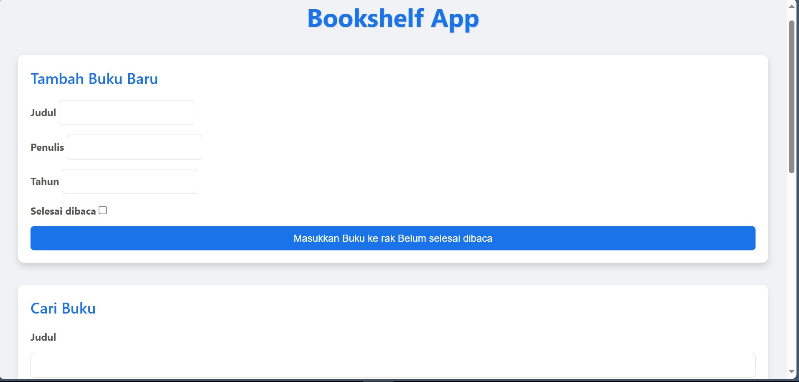
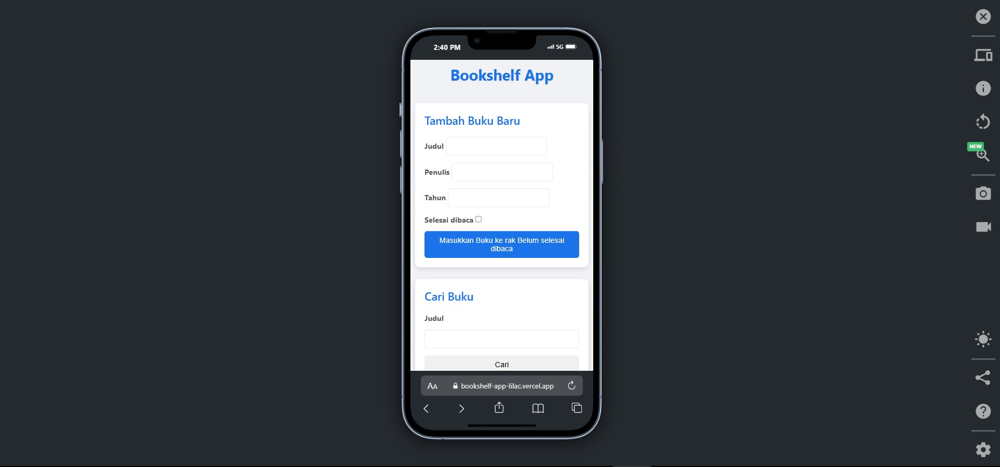

# 📚 Bookshelf App

[](https://bookshelf-app-lilac.vercel.app/)
[](https://github.com/yourusername/bookshelf-app/blob/main/LICENSE)

A modern web application for managing your personal book collection with beautiful UI and smooth interactions.

---

## ✨ Preview

| Desktop Version | Mobile Version |
|-----------------|----------------|
|  |  |

---

## 🚀 Live Demo

Experience the app live:  
[https://bookshelf-app-lilac.vercel.app/](https://bookshelf-app-lilac.vercel.app/)

## ✨ Features

### Core Features
✅ **CRUD Operations** - Full Create, Read, Update, Delete functionality  
✅ **Dual Bookshelves** - Separate shelves for completed and unread books  
✅ **Local Storage** - Persistent data storage using browser's localStorage  
✅ **Responsive Design** - Perfectly works on mobile & desktop  
✅ **Modern UI** - Sleek animations and transitions  

### Advanced Features
🔍 **Smart Search** - Instant book title search functionality  
📱 **Touch Optimized** - Smooth touch interactions for mobile devices  
🎨 **Theme System** - Modern color scheme with CSS variables  
✨ **Interactive UI** - Hover effects and click animations  
📤 **One-Click Export** - Data persists automatically  

## 🛠 Tech Stack

**Frontend:**  


**Deployment:**  


## 🛠 Installation

1. Clone the repository:
```bash
git clone https://github.com/yourusername/bookshelf-app.git

cd bookshelf-app && open index.html